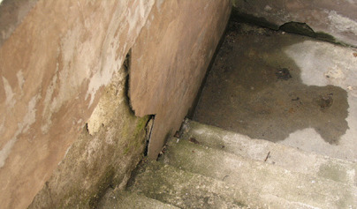

# Unsere Kunden

Sie hatten noch nie etwas mit Baugeologie zu tun und sind nicht sicher, ob Sie bei uns richtig sind?

Hier eine kleine Auswahl unserer typischen Kunden:

- Planungs- und Entwicklungsbüros
- Ingenieurbüros, Architekten
- Versicherungen
- Bauverwaltungen in Städten und Gemeinden
- Staatliche Bauämter
- Schulen, Fördereinrichtungen, Kirchliche Bauverwaltungen und Gemeinden
- Ausführende Bauwirtschaft im Hoch-, Tief, Grund- und Erd- sowie Garten- und Landschaftsbau
- Industrieunternehmen

