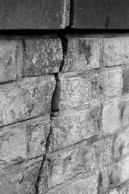

# Service

Wir untersuchen, berechnen, bewerten, entwickeln, empfehlen:

- Erdstatische Nachweise, unter anderem Setzungs-, Geländebruchberechnungen                                             
- Bemessung von Tragschichten und Fundamenten
- Maßnahmen bei setzungs- und grundbruchempfindlichen Böden
- Gutachterliche Stellungnahmen, beispielsweise zu Leistungsnachweis, 
    Gewährleistungsabgrenzung, Bauschadensanalyse, Sanierungsplanung
- Einsparmöglichkeiten bei Bauswerksabdichtung gegen Wasser
- Vorgehen bei Resten von gefährlichen Stoffen aus vorheriger Nutzung des Grundstücks
- Informationen zu physikalischen und chemischen Gegebenheiten.

Wir erarbeiten projektgerechte Empfehlungen auf geowissenschaftlicher Basis.        

Als Voraussetzung effektiver Planung und wirtschaftlicher Kalkulation Ihres Bauwerks liefern unsere baugeologischen Messungen und Untersuchungen maßgebliche Grundlagen.

